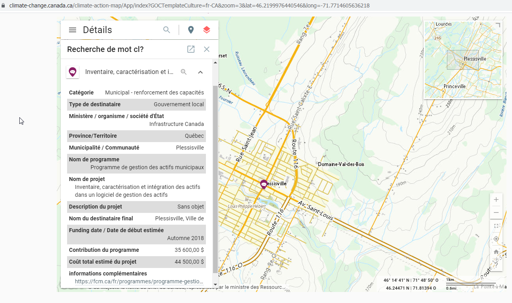
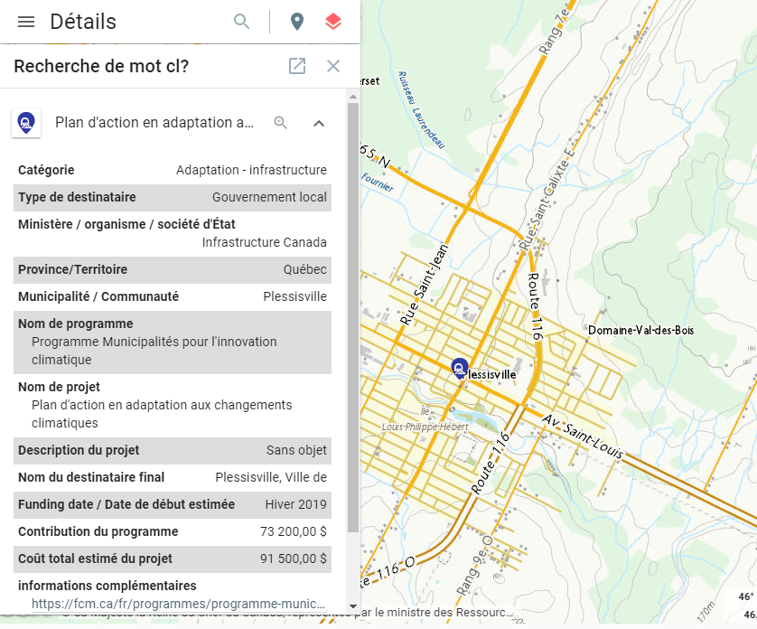
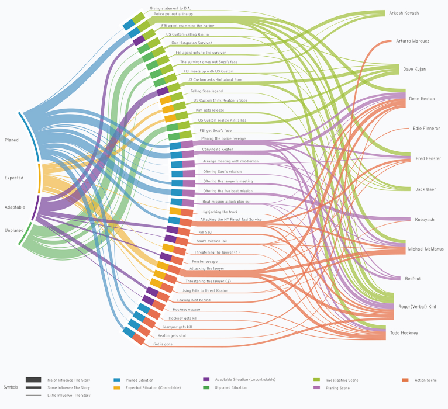

# Systemes de Gestion des Actifs / Asset Management Systems 

Nous utilisons l'analyse de données pour optimiser la durabilité, les opérations et l'environnement.  
//  
We use data analytics to optimize sustainability, operations and the environment.  

#### Capture d'écrans gestion des actifs.  / Screenshots Assets management.  

Reference FCM outil-evaluation-de-echelle-de-preparation-pour-la-gestion-des-actifs.xlsm  

# Références, guides, plans, règlements, normes: 
Plan Climatique Canadien:  https://climate-change.canada.ca/climate-action-map  
Ministère de l'Environnement:  https://www.quebec.ca/gouv/ministere/environnement/publications  
L’alliance canadienne des communautés de pratique en gestion d'actifs: https://assetmanagementcanada.ca  
Centre d’expertise et de recherche en infrastructures urbaines (CERIU) Québec. https://ceriu.qc.ca  
Guides:  https://www.cnam.ca/wp-content/uploads/2018/05/CNAM_MAMP_BOOKLET_2018_EN_HIRES-v1.1.pdf   
ISO 9001/14001/21500/27001/55001 Systèmes de gestion qualité, environnement, projets, information, actifs  

Plan Climatique Canadien:  
https://www.canada.ca/fr/services/environnement/meteo/changementsclimatiques/plan-climatique.html  
Ministère de l'Environnement et de la Lutte Contre les Changements Climatiques:  
https://www.quebec.ca/gouv/ministere/environnement/publications  
L’alliance canadienne des communautés de pratique en gestion d'actifs.  
https://assetmanagementcanada.ca  
La fédération canadienne des municipalités. Programme de gestion des actifs municipaux.  
https://fcm.ca/fr/programmes/programme-gestion-actifs-municipaux  
  
ISO 9001	Systèmes de gestion de la qualité.  
ISO 14001	Systèmes de gestion environnementale.  
ISO 21500	Systèmes de gestion de projets, programmes et portefeuilles.  
ISO 27001	Systèmes de gestion de la sécurité de l'information.  
ISO 55001	Systèmes de gestion des actifs.  
 
# Presentations, Youtubes
Greenhouse Gas Emissions Inventories Webinar. Municipal Climate Change Action Centre.  
https://www.youtube.com/watch?v=9ADdMSWI8C0  

# Images et gestion de matieres et d'énergies.
Certaines images peuvent contenir des droits d'auteurs. / Some images may be subject to copyrights.  

References:  
https://climate-change.canada.ca/climate-action-map  
https://climate-change.canada.ca/climate-action-map/App/index?GOCTemplateCulture=fr-CA&zoom=3&lat=46.2199976440546&long=-71.7714605636218  

# Analyses de donées / Data Analytics  
Images assorties d'analyses et de visualisations des données de gestion des actifs (toutes les images ne sont pas intégrées ici en raison des lois sur le droit d'auteur)  
//  
Assorted Pictures of assets management data analysis and visualisations (not all images are embedded here because of copyright laws)  

References, copyrights, wikicommons:  
https://commons.wikimedia.org/wiki/File:Sankeysteam.png  
https://en.wikipedia.org/wiki/Sustainability#/media/File:Sao_Paulo_Profile,_Level_1,_2012.jpg  
https://en.wikipedia.org/wiki/Material_flow_accounting  
https://upload.wikimedia.org/wikipedia/commons/thumb/1/19/Material_Flow_Accounting_Scheme.png/640px-Material_Flow_Accounting_Scheme.png  
By Shangri67 at English Wikipedia Public Domain, https://commons.wikimedia.org/w/index.php?curid=6446919  

## Lettre de presentation

Subventions PGAM pour les municipalités. Offre de service.  
 
Bonjour,  
 
Les plans environnementaux des gouvernements Québécois et Canadien subventionnent le Programme de Gestion des actifs municipaux (PGAM) via le Ministère des Affaires Municipales et de l’Habitation du Québec (MAMH) [1] et la Fédération Canadienne des Municipalités (FCM) [2].  L’objectif est d’accroître les compétences clés (gouvernance, planifications, données) des municipalités pour optimiser et assurer la continuité de leurs programmes de gestion des actifs (ressources naturelles, matérielles, humaines et logistiques). 
 
L'offre de financement peut couvrir jusqu'à 80% ou 90% des coûts totaux d’un projet, jusqu'à concurrence de $50,000 [2,14,15]. Les projets doivent être terminés dans un délai de 12 mois suivant la date d'approbation du financement. Les fonds sont versés lorsque la municipalité aura livré un rapport final complet qui satisfait aux exigences de: production de rapports, d’audit et d'admissibilité des coûts [13 p.13,16,17].  
 
Les activités financées par le programme peuvent être par exemple: l'évaluation et la planification de la gestion des actifs; la collecte de données, la production de rapports [7]; la formation et le développement; le transfert de connaissances [13 p.4].
 
Notre entreprise de gestion de systèmes offre des services de support pour ces activités et pour d'autres systèmes de gestion et du support à d'autres programmes subventionnés pour $70/hr (2021) [4,5,6,7,8,9]. Nos honoraires sont des coûts admissibles [13 p.17, 14 p.6]). Nos méthodes de travail sont conformes aux normes et instructions de la FCM [3,13].  
 
Nos systèmes [7] existent déjà (donc il n'y a pas pas de frais de développement) et sont:  
1) des registres-chiffriers ouverts (.ods), collaboratifs, distribués (nuage internet, git) ou des systèmes locaux, fermés (.xls intranet);  
2) conformes aux requis et normes du PGAM et de ISO (gestion de systèmes et données: actifs, qualité, sécurité, environnement, confidentialité, intégrité, gouvernance, amélioration continue) [7]. 
 
Pour des exemples municipaux et industrielles déjà existants SVP voir [10,11,12].  
 
Il nous fera plaisir de vous contacter si vous voulez. Merci de votre attention.  
 
Références  
[1] https://www.mamh.gouv.qc.ca/developpement-territorial/fonds-et-programmes/programme-de-gestion-des-actifs-municipaux-pgam/  
[2] https://www.fcm.ca/fr/programmes/programme-gestion-actifs-municipaux  
[3] https://fcm.ca/fr/ressources/pgam/etablir-la-portee-de-votre-projet-de-gestion-des-actifs
[4] https://github.com/jean-francoisgiraud  
[5] https://sites.google.com/site/8289468canadainc  
[6] https://www.linkedin.com/in/jfgiraudengineer  
[7] https://github.com/jean-francoisgiraud/AssetManagementSystems  
[8] https://www.quebec.ca/securite-situations-urgence/securite-civile/soutien-municipalites/preparation-sinistres  
[9] https://www.environnement.gouv.qc.ca/index.asp  
[10] https://www.youtube.com/watch?v=3qm-Y5fLHXs  
[11] https://climate-change.canada.ca/climate-action-map
[12] https://www.youtube.com/channel/UCvNxo97F92DibIA5zx9e-cw  
[13] https://data.fcm.ca/documents/funding/mamp/guide-de-presentation-des-demandes.PDF
[14] https://fcm.ca/sites/default/files/documents/funding/mamp/formulaire-de-demande.pdf  
[15] https://www.portailmunicipal.gouv.qc.ca/SitePublic/   
 

