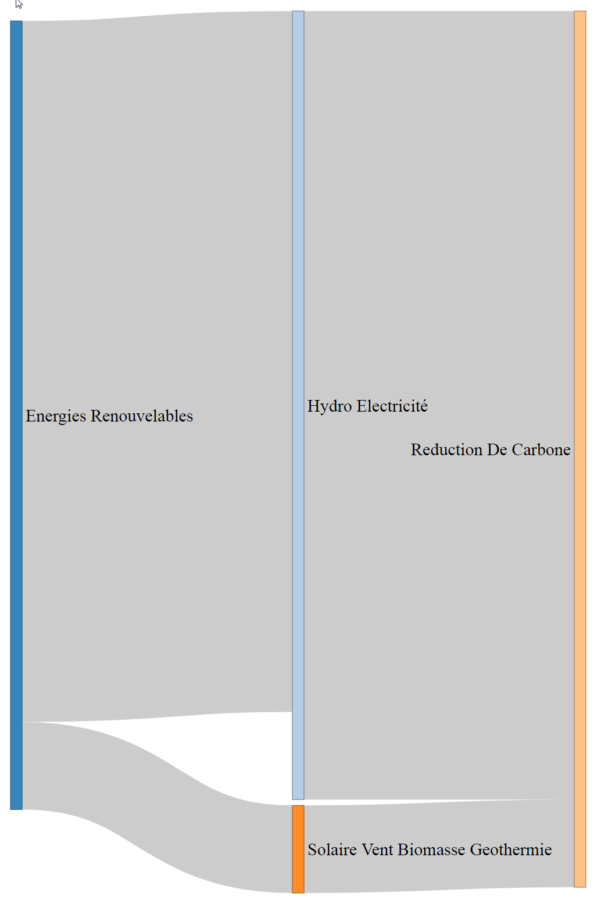

This is a bilingual document, the English version follows the french version.  
Ce document est bilingue, la version Francaise precede la version Anglaise.  

# Systemes de Gestion et Optimisation des Actifs / Asset Management and Optimisation Systems. 

Nous utilisons la gestion de qualité/projets et l'analyse des données pour optimiser le developement durabilité, les opérations, la conformité reglementaire et l'environnement.  //  
We use quality/project managment and data analytics to optimize sustainability, operations, regulatory compliance and the environment.  

#### Capture d'écrans gestion des actifs.  / Screenshots Assets management.  

Reference FCM outil-evaluation-de-echelle-de-preparation-pour-la-gestion-des-actifs.xlsm  

# Presentations, Youtubes
Greenhouse Gas Emissions Inventories Webinar. Municipal Climate Change Action Centre.  
https://www.youtube.com/watch?v=9ADdMSWI8C0  

# Gestion des ressources de la matière, l'énergie, plans de travail. / Management of resources materials, energy, workflows.
Certaines images peuvent contenir des droits d'auteurs. / Some images may be subject to copyrights.  

References:  
https://climate-change.canada.ca/climate-action-map  
https://climate-change.canada.ca/climate-action-map/App/index?GOCTemplateCulture=fr-CA&zoom=3&lat=46.2199976440546&long=-71.7714605636218 

# Images et diagrammes d'analyses des données / Images and diagrams of Data Analytics  
Images assorties de plans, d'optimisations, d'analyses et de visualisations des données de gestion des actifs (il y a des images produites par notre entreprise et d'autres organismes).  
//  
Assorted Pictures of assets management data analysis and visualisations (some images are from our company and other images are from other organisations).  

  
  
  
Diagramme de réseau pour un projet de sept mois avec cinq jalons (10 à 50) et six activités (A à F).  
PERT network chart for a seven-month project with five milestones (10 through 50) and six activities (A through F).  

# Images d'autres organisations // Images from other organisations: 

References, copyrights, wikicommons, disclaimers:  
Images and diagramms via: Wikipedia, ResearchGate, GreenCarCongress.  
Images may be subject to copyright  
https://www.ontario.ca/document/building-better-lives-ontarios-long-term-infrastructure-plan-2017/chapter-2-planning-future  
https://www.r-graph-gallery.com/sankey-diagram.html  
https://www.sankey-diagrams.com/excelling-in-excel/  
https://commons.wikimedia.org/wiki/File:Sankeysteam.png  
https://en.wikipedia.org/wiki/Sustainability#/media/File:Sao_Paulo_Profile,_Level_1,_2012.jpg  
https://www.researchgate.net/figure/Sankey-diagram-showing-the-cumulative-flow-of-materials-through-the-global-economy-from_fig3_326507485  
https://www.greencarcongress.com/2018/04/201080420-llnl.html  
https://en.wikipedia.org/wiki/Material_flow_accounting  
https://upload.wikimedia.org/wikipedia/commons/thumb/1/19/Material_Flow_Accounting_Scheme.png/640px-Material_Flow_Accounting_Scheme.png  
By Shangri67 at English Wikipedia Public Domain, https://commons.wikimedia.org/w/index.php?curid=6446919  

# Références, guides, plans, règlements, normes: 
Plan Climatique Canadien:  https://climate-change.canada.ca/climate-action-map  
Ministère de l'Environnement:  https://www.quebec.ca/gouv/ministere/environnement/publications  
L’alliance canadienne des communautés de pratique en gestion d'actifs: https://assetmanagementcanada.ca  
Centre d’expertise et de recherche en infrastructures urbaines (CERIU) Québec. https://ceriu.qc.ca  
Guides:  https://www.cnam.ca/wp-content/uploads/2018/05/CNAM_MAMP_BOOKLET_2018_EN_HIRES-v1.1.pdf   
ISO 9001/14001/21500/27001/55001 Systèmes de gestion qualité, environnement, projets, information, actifs  

Plan Climatique Canadien:  
https://www.canada.ca/fr/services/environnement/meteo/changementsclimatiques/plan-climatique.html  
Ministère de l'Environnement et de la Lutte Contre les Changements Climatiques:  
https://www.quebec.ca/gouv/ministere/environnement/publications  
L’alliance canadienne des communautés de pratique en gestion d'actifs.  
https://assetmanagementcanada.ca  
La fédération canadienne des municipalités. Programme de gestion des actifs municipaux.  
https://fcm.ca/fr/programmes/programme-gestion-actifs-municipaux  
  
ISO 9001	Systèmes de gestion de la qualité.  
ISO 14001	Systèmes de gestion environnementale.  
ISO 21500	Systèmes de gestion de projets, programmes et portefeuilles.  
ISO 27001	Systèmes de gestion de la sécurité de l'information.  
ISO 55001	Systèmes de gestion des actifs.  
  

## Codes (R)
Voici des exemples de code R [1] que nous utilions pour produire les plans, optimisations, analyses et diagrammmes les plus complexes.  
// 
Here is some examples of the R code [2] we use to produce the more complex plans, optimisations, data analysis, diagrams and graphics.  

[1] R est un langage de programmation et un logiciel libre destiné aux statistiques et à la science des données. ref https://fr.wikipedia.org/wiki/R_(langage)  
[2] R is a programming language and free software environment for statistical computing and graphics supported by the R Foundation for Statistical Computing. The R language is widely used among statisticians and data miners for developing statistical software and data analysis. ref https://en.wikipedia.org/wiki/R_(programming_language)  

## References (code, R, DataScience, DataVisualisation)
https://www.jessesadler.com/post/network-analysis-with-r/  
https://kateto.net/network-visualization  (only go there if you have a powerful computer with lots of memory the page contains lots of heavy graphics)  
https://medium.com/analytics-vidhya/project-management-tools-with-r-7f5fcacb2d4  

https://www.displayr.com/sankey-diagrams-r/  
library(networkD3)  
nodes = data.frame("name" =  
 c("Energies-Renouvelables", # Node 0 
 "HydroElectricité", # Node 1  
 "SolaireEolienBiomassGeothermique", # Node 2  
 "ReductionDeCarbone"))# Node 3  
links = as.data.frame(matrix(c(  
 0, 1, 20, # Each row represents a link. The first number  
 0, 2, 10, # represents the node being conntected from.  
 1, 3, 90, # the second number represents the node connected to.  
 2, 3, 10),# The third number is the value of the node  
 byrow = TRUE, ncol = 3))  
names(links) = c("source", "target", "value")  
sankeyNetwork(Links = links, Nodes = nodes,  
 Source = "source", Target = "target",  
 Value = "value", NodeID = "name",  
 fontSize= 30, nodeWidth = 30)  
 
 Project Management PERT DAG  
prec1and2<-matrix(c(0,1,0,2,0,0,0,0,0,1,0,0,0,1,0,0,0,0,0,0,0,0,0,2,0),nrow=5,ncol=5,byrow=TRUE)  
prec3and4<-matrix(0,nrow=5,ncol=5)  
prec3and4[3,1]<-3  
dag.plot(prec1and2,prec3and4)  

## Graphe orienté acyclique (ordonnancement et planification) CPM // DAG (Directed acyclic graph) PERT (program evaluation and review technique) CPM (Critical Path Method)

La technique d'évaluation et de revue de programme (ou de projet) (PERT) est un outil statistique utilisé dans la gestion de projet, qui a été conçu pour analyser et représenter les tâches impliquées dans la réalisation d'un projet donné.  
//  
The program (or project) evaluation and review technique (PERT) is a statistical tool used in project management, which was designed to analyze and represent the tasks involved in completing a given project.  

References:  
https://en.wikipedia.org/wiki/Directed_acyclic_graph#Applications  
https://fr.wikipedia.org/wiki/PERT  
https://www.capgemini.com/gb-en/2020/10/introducing-directed-acyclic-graphs-and-their-use-cases/  
https://www.workamajig.com/blog/critical-path-method  

## Lettre de presentation

Subventions pour les municipalités (PGAM, FIMEAU, etc). Offre de service et d'accompagnement personnalisé.  
Bonjour, 
 
Les plans environnementaux des gouvernements Québécois et Canadien subventionnent le Programme de Gestion des actifs municipaux (PGAM) via le Ministère des Affaires Municipales et de l’Habitation du Québec (MAMH) [1] et la Fédération Canadienne des Municipalités (FCM) [2].  
 
L’objectif est d’accroître les compétences clés (gouvernance, planifications, analyses des données, améliorations continues) des municipalités pour optimiser et assurer la continuité de leurs programmes de gestion des actifs (ressources naturelles, matérielles, humaines et logistiques). 
 
L'offre de financement peut couvrir jusqu'à 80% ou 90% des coûts totaux d’un projet, jusqu'à concurrence de $50,000 [2,14,15]. Les projets doivent être terminés dans un délai de 12 mois suivant la date d'approbation du financement. Les fonds sont versés lorsque la municipalité aura livré un rapport final complet qui satisfait aux exigences de: production de rapports, d’audit et d'admissibilité des coûts [13 p.13,16,17].  
 
Les activités financées par le programme peuvent être par exemple: l'évaluation et la planification de la gestion des actifs; la collecte, l'analyse et la visualisation de données; la production de rapports; la formation et le développement; le transfert de connaissances [13 p.4].
 
Notre entreprise de gestion de systèmes et d'opérations, de vérification réglementaire, d'analytique (analyse et visualisation de données) offre des services de support pour ce type d'activités, pour des mises aux normes et pour la préparation des demandes de subvention à divers programmes tel que le PGAM, FIMEAU (Fonds pour l'Infrastructure Municipale d'Eau), etc. [4,5,6,7,8,9]. 
 
Nos honoraires ($70/hr en 2021) sont des coûts admissibles [13 p.17, 14 p.6]). Nos méthodes de travail sont conformes aux normes de la FCM [3,13].  
 
Nos systèmes documentent, analysent, visualisent vos données; optimisent vos opérations et sont:  
- des registres-chiffriers programmes ouverts (.ods .r), collaboratifs, distribués (nuage internet, git) ou des systèmes locaux, fermés (des fichiers .xls .r sur un intranet privé);  
- conformes aux requis et normes du PGAM et de ISO (gestion de systèmes et données: actifs, qualité, sécurité, environnement, confidentialité, intégrité, gouvernance, amélioration continue).
 
Pour des exemples et échantillons de notre travail déjà existants SVP voir [7,10,11,12].  
 
Il nous fera plaisir de vous contacter ou de vous rencontrer [16] pour évaluer vos besoins.  Merci.  
 
Références et notes:  
[1] https://www.mamh.gouv.qc.ca/developpement-territorial/fonds-et-programmes/programme-de-gestion-des-actifs-municipaux-pgam/  
[2] https://www.fcm.ca/fr/programmes/programme-gestion-actifs-municipaux  
[3] https://fcm.ca/fr/programmes  
[4] https://github.com/jean-francoisgiraud  
[5] https://sites.google.com/site/8289468canadainc  
[6] https://www.linkedin.com/in/jfgiraudengineer  
[7] https://github.com/jean-francoisgiraud/AssetManagementSystems/blob/main/readme.md  
[8] https://www.quebec.ca/securite-situations-urgence/securite-civile/soutien-municipalites/preparation-sinistres  
[9] https://www.environnement.gouv.qc.ca/index.asp  
[10] https://www.youtube.com/watch?v=3qm-Y5fLHXs  
[11] https://climate-change.canada.ca/climate-action-map/App/index?GOCTemplateCulture=fr-CA  
[12] https://www.youtube.com/channel/UCvNxo97F92DibIA5zx9e-cw  
[13] https://data.fcm.ca/documents/funding/mamp/guide-de-presentation-des-demandes.pdf
[14] https://fcm.ca/sites/default/files/documents/funding/mamp/formulaire-de-demande.pdf  
[15] https://www.portailmunicipal.gouv.qc.ca/SitePublic/  
[16] Nous sommes disponibles par téléphone, courriel, visioconférence et en personne dans certaines zones.  

## Presentation Letter
Grants for municipalities (MAMH, FIMEAU, etc). Service offer and personalized support.
Hello,
 
The environmental plans of the Quebec and Canadian governments subsidize the Municipal Asset Management Program (MAMP) via the Quebec Ministry of Municipal Affairs and Housing (MAMH) [1] and the Canadian Federation of Municipalities (FCM) [2] .
 
The objective is to increase the key skills (governance, planning, data analysis, continuous improvements) of municipalities to optimize and ensure the continuity of their asset management programs (natural resources, material, human and logistics).
 
The financing offer can cover up to 80% or 90% of the total costs of a project, up to a maximum of $ 50,000 [2,14,15]. Projects must be completed within 12 months of the date of funding approval. Funds are disbursed when the municipality has delivered a complete final report that meets the requirements for: reporting, auditing and cost eligibility [13 p.13,16,17].
 
Activities funded by the program may include, for example: asset management assessment and planning; data collection, analysis and visualization; reporting; training and development; knowledge transfer [13 p.4].
 
Our company offers management of systems and operations, verification of regulatory compliances, analytics (data analysis and visualization) and support services for this type of activity, for upgrading to standards and for the preparation of grant applications for various programs and governmental grants for municipal infrastructure such as the MAMP, FIMEAU (Fonds pour l'Infrastructure Municipale d'Eau), etc. [4,5,6,7,8,9].
 
Our fees ($ 70 / hr in 2021) are eligible costs [13 p.17, 14 p.6]). Our working methods comply with FCM standards [3,13].
 
Our systems document, analyze, visualize your data and optimize your operations and are:
- open spreadsheet registers, programs  (.ods .r), collaborative, distributed (internet cloud, git) or local, closed systems (.xls .r files on a private intranet);
- compliant with the requirements and standards of the PGAM and ISO (systems and data management: assets, quality, security, environment, confidentiality, integrity, governance, continuous improvement).
 
For already existing examples and samples of our work please see [7,10,11,12].
 
It will be our pleasure to contact or meet with you [16] to assess your needs. Thank you.
 
References and notes:  
[1] https://www.mamh.gouv.qc.ca/developpement-territorial/fonds-et-programmes/programme-de-gestion-des-actifs-municipaux-pgam/  
[2] https://www.fcm.ca/en/programs/municipal-asset-management-program  
[3] https://fcm.ca/en/programs  
[4] https://github.com/jean-francoisgiraud  
[5] https://sites.google.com/site/8289468canadainc  
[6] https://www.linkedin.com/in/jfgiraudengineer  
[7] https://github.com/jean-francoisgiraud/AssetManagementSystems/blob/main/readme.md  
[8] https://www.quebec.ca/securite-situations-urgence/securite-civile/soutien-municipalites/preparation-sinistres  
[9] https://www.environnement.gouv.qc.ca/index_en.asp  
[10] https://www.youtube.com/watch?v=3qm-Y5fLHXs  
[11] https://climate-change.canada.ca/climate-action-map  
[12] https://www.youtube.com/channel/UCvNxo97F92DibIA5zx9e-cw  
[13] https://data.fcm.ca/documents/funding/mamp/application-guide.PDF  
[14] https://fcm.ca/sites/default/files/documents/funding/mamp/application-form.pdf  
[15] https://www.portailmunicipal.gouv.qc.ca/SitePublic/  
[16] We are available by phone, email, video conference and in person in some areas.  
